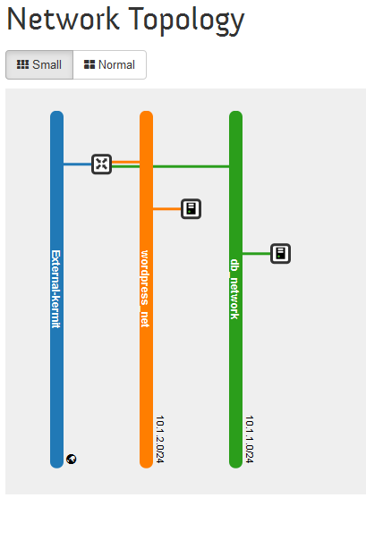
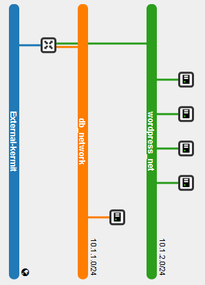

Heat templates to install wordpress application through VMware Integrated Openstack (inspired by https://github.com/miguelgrinberg/heat-tutorial)

[Note] Remember to download "lib" folder as well when you want to use the heat_*.yaml templates.

1) heat_wp.yaml
------------------------------------------------------

1.1) Network topology
------------------------------------------------------


1.2) Validation - http://floating_ip_address , a wordpress installation page shows up.

2) heat_wp_ha.yaml
------------------------------------------------------

2.1) Network topology
------------------------------------------------------


2.2) Instances under private network "wordpress_network":
A wordpress cluster plus one load balancer. Floating ip is associated with load balancer.

2.3) Validation - http://floating_ip_addr, a wordpress installation page shows up. It's roundrobin balancer, so refresh the ip multiple times to check all wordpress instances work fine.

2.4) Samples :

- create one mysql, 3 wordpress VMs and one load balancer with two 2GB volumes attached each:

```
heat stack-create wordpress_ha -f heat_wp_ha.yaml -P "public_network_id=<uuid of external/public network>;key=;wordpress_cluster_size=3;volume_count=2;volume_size=2"
```

- scale-out wordpress cluster:

```
heat stack-update wordpress_ha -f heat_wp_ha.yaml -P "public_network_id=<uuid of external/public network>;key=;wordpress_cluster_size=5;volume_count=2;volume_size=2"
```
